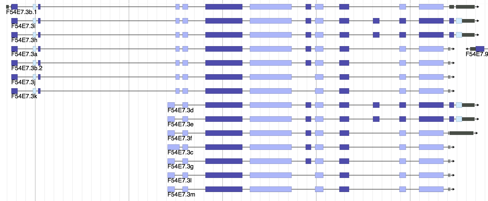

# colorbycds

A JBrowse plugin for viewing the frame that a coding sequences of a gene is in and coloring the DNA track and gene appropriately

## Screenshot

## Example

    {
     "label" : "genes",
     "urlTemplate" : "tracks/genes/{refseq}/trackData.json",
     "storeClass" : "JBrowse/Store/SeqFeature/NCList",
     "type" : "CanvasFeatures",
     "glyph" : "ColorByCDS/View/FeatureGlyph/Gene"
    }

Note that if you loaded your data with two levels e.g. mRNA->exon/cds instead of three levels e.g. gene->mRNA->exon/cds then use "ColorByCDS/View/FeatureGlyph/ProcessedTranscript" as the glyph.

## Installation

Download to plugins/ColorByCDS and add

    "plugins": ["ColorByCDS"]

to jbrowse_conf.json or trackList.json. See JBrowse FAQ on installing plugins for more details

## Notes

Relies on the phase field (column 8) of your GFF to be calculated correctly. Use genometools `gt gff3 -tidy yourfile.gff > yourfile_fixed.gff` to recalculate phase properly

